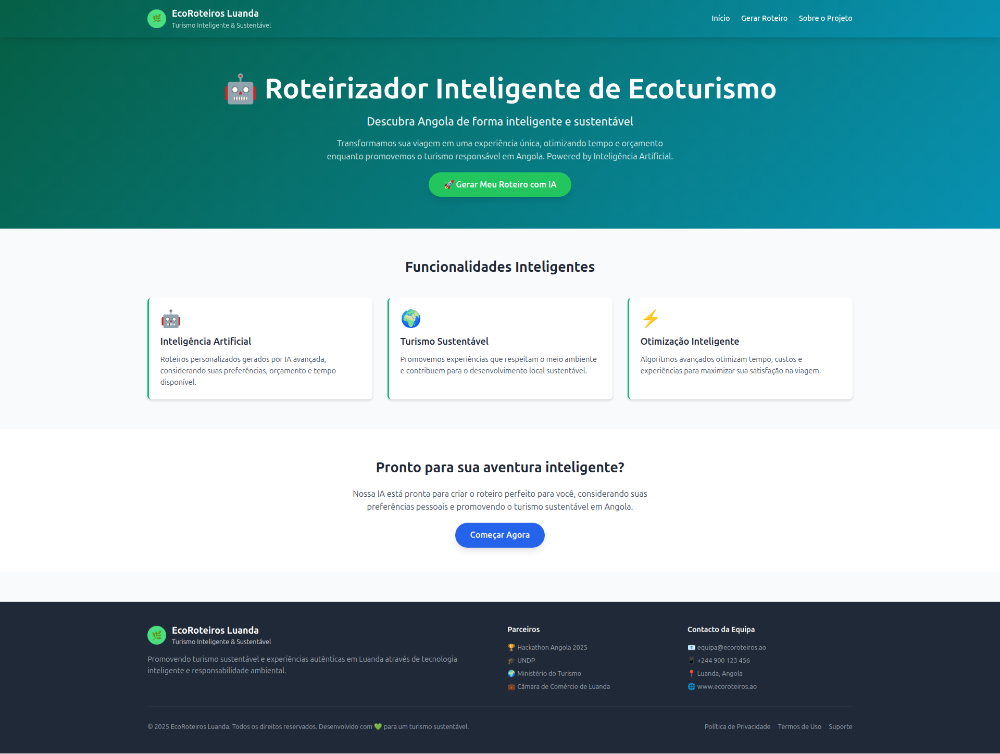
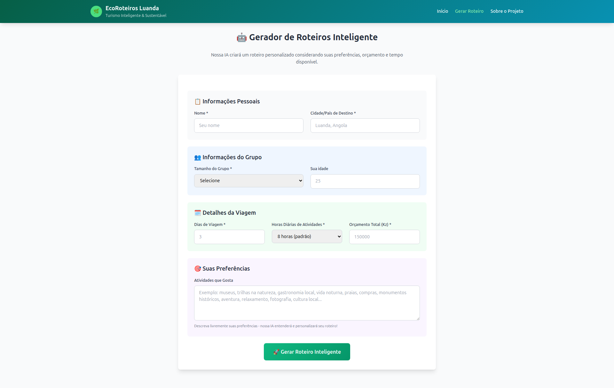
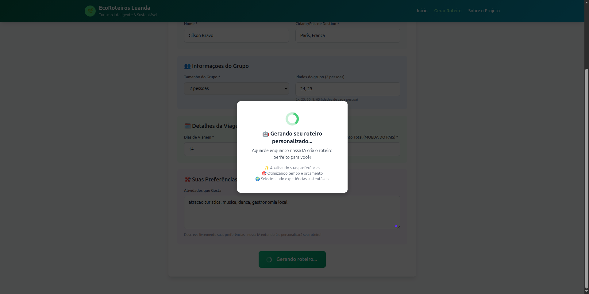
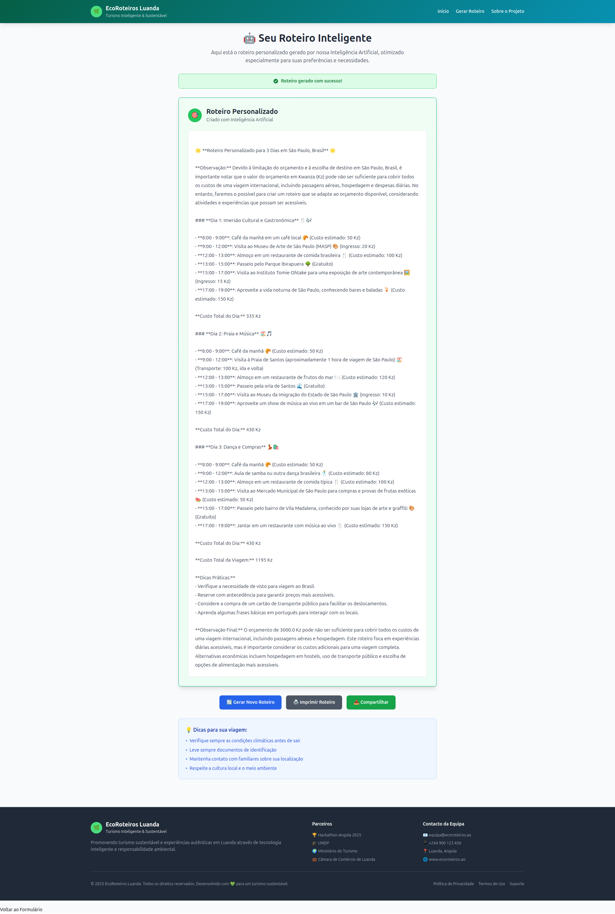

# EcoRoteiros Luanda - Roteirizador Inteligente de Ecoturismo

Uma aplicação web que utiliza Inteligência Artificial para gerar roteiros de viagem personalizados e sustentáveis para Angola.

## Descrição do Projeto

O EcoRoteiro IA é uma plataforma desenvolvida para o Hackathon FTL 2025 que revoluciona a forma como os turistas exploram Angola. A aplicação combina inteligência artificial avançada com princípios de sustentabilidade ambiental para criar roteiros personalizados que otimizam tempo, custos e experiências.

## Funcionalidades

- Geração de roteiros personalizados usando IA (Llama-3.3-70B-Instruct)
- Interface web responsiva e intuitiva
- Otimização de orçamento e tempo
- Foco em turismo sustentável
- Consideração de preferências pessoais e tamanho do grupo

## Tecnologias Utilizadas

- **Backend**: Python Flask
- **Frontend**: HTML, CSS (Tailwind CSS), JavaScript
- **IA**: Hugging Face API (Llama-3.3-70B-Instruct)
- **Estilização**: Tailwind CSS, Bootstrap (para página de roteiro)

## Pré-requisitos

- Python 3.7 ou superior
- pip (gerenciador de pacotes Python)

## Instalação e Configuração

### 1. Clone o repositório
```bash
git clone https://github.com/Hackaton-FTL/roteiro_web.git
cd roteiro_web
```

### 2. Crie um ambiente virtual (recomendado)
```bash
python -m venv .venv
```

### 3. Ative o ambiente virtual
**No Windows:**
```bash
.venv\Scripts\activate
```

**No Linux/Mac:**
```bash
source .venv/bin/activate
```

### 4. Instale as dependências
```bash
pip install -r requirements.txt
```

### 5. Configure a API Key da Hugging Face
A aplicação requer uma chave de API da Hugging Face configurada como variável de ambiente:

1. Crie uma conta em https://huggingface.co/
2. Gere uma API key em https://huggingface.co/settings/tokens
3. Crie um arquivo `.env` na raiz do projeto:
```bash
cp .env.example .env
```
4. Edite o arquivo `.env` e adicione sua chave:
```
HUGGINGFACE_API_KEY=sua_chave_da_hugging_face_aqui
```

**Importante**: Nunca commite o arquivo `.env` no Git. Ele já está incluído no `.gitignore`.

## Como Executar

### 1. Execute a aplicação
```bash
python app.py
```

### 2. Acesse no navegador
Abra seu navegador e acesse:
```
http://localhost:5001
```

## Estrutura do Projeto

```
roteiro_web/
├── app.py                 # Aplicação principal Flask
├── requirements.txt       # Dependências do projeto
├── README.md             # Este arquivo
├── images/               # Screenshots da aplicação
├── templates/            # Templates HTML
│   ├── home.html        # Página inicial
│   ├── generator.html   # Formulário de geração de roteiro
│   ├── about.html       # Página sobre o projeto
│   └── roteiro.html     # Página de exibição do roteiro
└── .venv/               # Ambiente virtual (criado após instalação)
```

## Como Usar

1. **Página Inicial**: Acesse a página inicial para conhecer o projeto
2. **Gerar Roteiro**: Clique em "Gerar Roteiro" e preencha o formulário com:
   - Nome
   - Cidade de destino
   - Tamanho do grupo e idades
   - Número de dias da viagem
   - Horas diárias de atividades
   - Orçamento total
   - Preferências de atividades
3. **Visualizar Roteiro**: Após o processamento, visualize seu roteiro personalizado
4. **Sobre o Projeto**: Conheça mais sobre os objetivos e equipe

## Screenshots da Aplicação

### Página Inicial


### Formulário de Geração de Roteiro


### Formulário Preenchido


### Roteiro Gerado


## Solução de Problemas

### Erro de Conexão com a API
- Verifique sua conexão com a internet
- Confirme se a API key da Hugging Face está válida
- Aguarde alguns instantes e tente novamente

### Erro de Dependências
```bash
pip install --upgrade pip
pip install -r requirements.txt
```

### Porta já em uso
Se a porta 5001 estiver ocupada, altere no arquivo `app.py`:
```python
app.run(debug=True, port=5002)  # ou outra porta disponível
```

## Desenvolvimento

### Estrutura do Código
- `app.py`: Contém todas as rotas Flask e lógica de negócio
- `templates/`: Contém os templates HTML da aplicação
- A aplicação não utiliza banco de dados, funcionando inteiramente com IA

### Principais Rotas
- `/`: Página inicial
- `/generator`: Formulário de geração de roteiro
- `/about`: Página sobre o projeto
- `/roteiro`: Processamento e exibição do roteiro (POST)

## Equipe

- **António Pedro** - Desenvolvedor Full-Stack
- **Luisani Caiuque** - UX/UI Designer
- **Jandiro Tanque** - Analista de Dados
- **José Vale** - Especialista em Turismo

## Licença

Desenvolvido para o Hackathon FTL 2025. Todos os direitos reservados.

## Contato

- Email: equipa@ecoroteiros.ao
- Telefone: +244 900 123 456
- Localização: Luanda, Angola